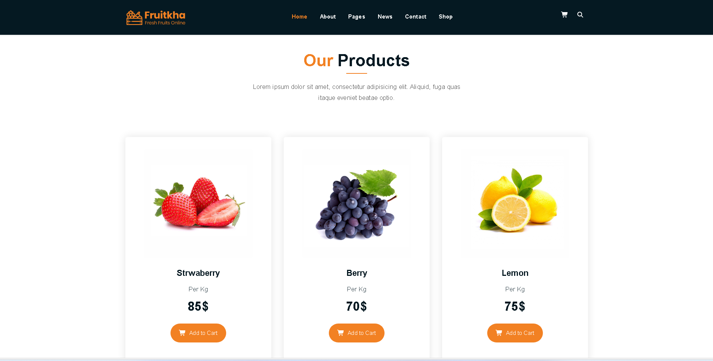
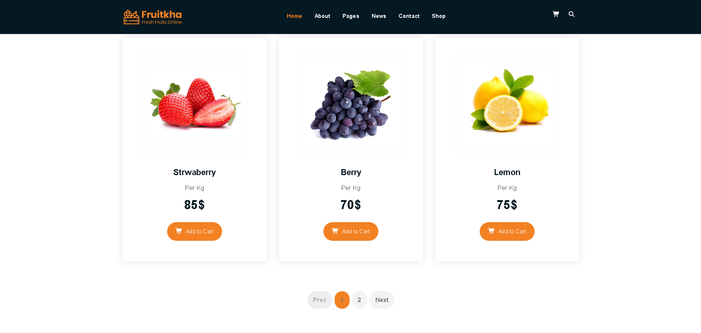
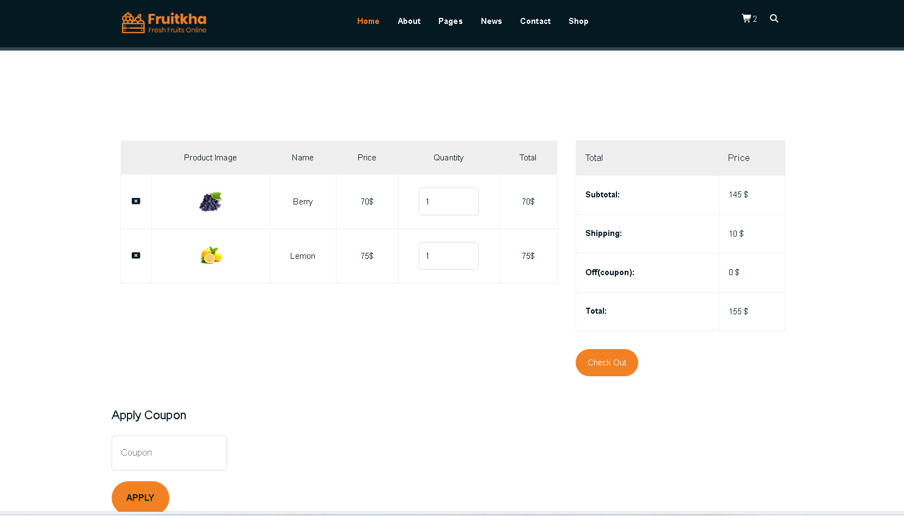

# 🍎 React Shopping App

A modern and responsive fruit shopping application built with **React**. Users can browse fresh fruits, view product details, add items to the shopping cart, and enjoy a clean and user-friendly shopping experience.

## 🚀 Live Demo

🔗 https://your-project-name.netlify.app

## 📸 Screenshots

### Home Page


### Shop Page



### Cart Page


---

## ✨ Features

- 🛒 Shopping Cart
- 🍎 Browse Fresh Fruits
- 📦 Product Details
- ⚡ Fast Performance with Vite
- 🔄 Dynamic Routing with React Router
- 💾 Global State Management using Context API

---

## 🛠️ Built With

- React
- Vite
- React Router DOM
- Context API
- JavaScript (ES6+)
- CSS3
- HTML5

---

## 📂 Project Structure

```
src/
├── api/
├── assets/
├── components/
├── context/
├── pages/
├── App.jsx
└── main.jsx
```

---

## 📦 Installation

Clone the repository

```bash
git clone https://github.com/setareh-kazemi10/react-shopping-app.git
```

Go to the project directory

```bash
cd react-shopping-app
```

Install dependencies

```bash
npm install
```

Run the development server

```bash
npm run dev
```

---

## 🌐 Deployment

This project is deployed on **Netlify**.

Live Website:

https://your-project-name.netlify.app

---

## 👨‍💻 Author

GitHub:
https://github.com/setareh-kazemi10


